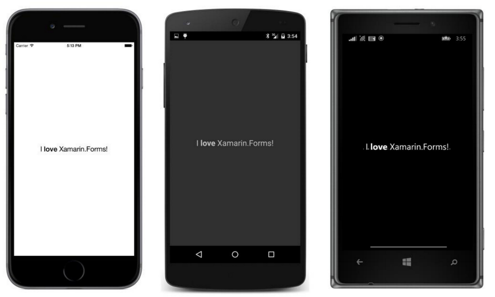

## Texto Formatado {#texto-formatado}

Como você viu, Label tem uma propriedade Text que você pode definir como uma string. Mas Label também tem uma propriedade alternativa FormattedText que constrói um parágrafo com formatação não uniforme.

A propriedade FormattedText é do tipo FormattedString, que tem uma propriedade Spans do tipo IList&lt;Span&gt;, uma coleção de objetos Span. Cada objeto Span é um pedaço de texto formatado de maneira uniforme que é definido por seis propriedades:

*   **Text**
*   **FontFamily**
*   **FontSize**
*   **FontAttributes**
*   **ForegroundColor**
*   **BackgroundColor**

Aqui está uma maneira de instanciar um objeto FormattedString e então adicionar instâncias Span a sua propriedade de coleção Spans:

À medida que cada Span é criado, é passado diretamente ao método Add da coleção Spans. Note que o Label tem um FontSize de NamedSize.Large, e o Span com a configuração Bold também tem explicitamente o mesmo tamanho. Quando um Span tem uma configuração de FontAttributes, atualmente ele não herda a configuração FontSize do Label.

Alternativamente, é possível inicializar o conteúdo da coleção Spans envolvendo-o com um par de chaves. Dentro destas chaves, os objetos Span são instanciados. Porque não é necessárias as chamadas de método, toda a inicialização de FormattedString pode ocorrer dentro da inicialização do Label:

Esta é a versão do programa que você vai ver na coleção de código de exemplo para este capítulo. Independentemente de qual abordagem você usa, aqui está como ele parece:

Você também pode usar a propriedade FormattedText para deixar palavras em itálico ou negrito dentro de um parágrafo, como o programa **VariableFormattedParagraph** demonstra:

|  |  |
| --- | --- |

O parágrafo começa com um espaço ‘em’ (Unicode \u2003) e contém chamadas de aspas (\u201C e \u201D), e várias palavras estão em itálico:

Você pode ter um único Label para mostrar múltiplas linhas ou parágrafos com a inserção de caracteres de quebra de linha (\n). Isto é demonstrado no programa **NamedFontSizes**. Vários objetos Span são adicionados a um objeto FormattedString em um laço foreach. Cada objeto Span usa um valor diferente para NamedFont e também mostra o tamanho real retornado de Device.GetNamedSize:

Note que um Span separado contém duas quebras de linha para espaçar as linhas individuais. Isto garante que o espaçamento entre linhas é baseado no tamanho padrão da fonte em vez do tamanho da fonte exibida:

Estes não são tamanhos de pixel! Tal como acontece com a altura da barra de status iOS, é melhor se referir a estes tamanhos como uma espécie de &quot;unidades&quot; de tamanho. Alguma clareza adicional será vista no Capítulo 5.

Claro que, o uso de vários objetos Span em um único Label não é uma boa maneira para renderizar múltiplos parágrafos de texto. Além disso, o texto muitas vezes tem tantos parágrafos que deve ser rolado. Este é o trabalho para o próximo capítulo e a exploração de StackLayout e ScrollView.