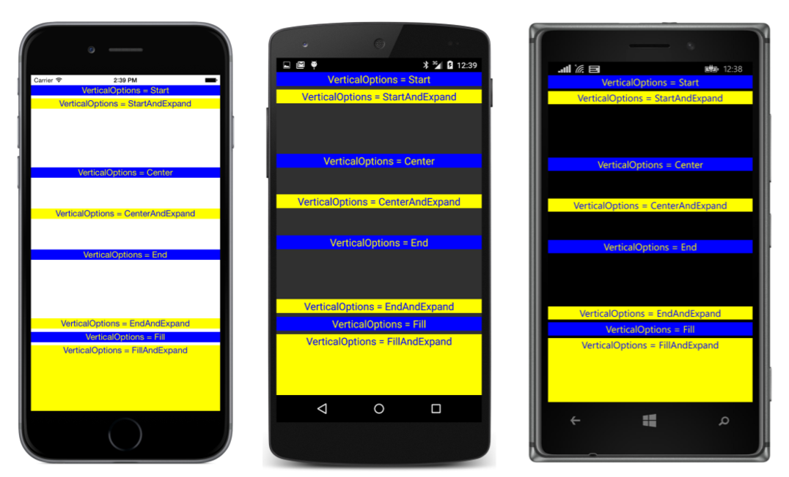

## A opção Expands {#a-op-o-expands}

Você provavelmente notou que as propriedades _HorizontalOptions_ e _VerticalOptions_ são plurais, como se houvesse mais que uma opção. Essas propriedades são geralmente definidas como um campo estático da estrutura _LayoutOptions_ – outro plural.

As discussões até agora se concentraram nos seguintes campos _LayoutOptions_ somente leitura estáticos que retornam valores predefinidos de _LayoutOptions_:

*   _LayoutOptions.Start_
*   _LayoutOptions.Center_
*   _LayoutOptions.End_
*   _LayoutOptions.Fill_

O padrão – estabelecido pela classe View – é LayoutOptions.Fill, o que quer dizer que as _views_ preenchem o recipiente.

Como você viu, um _VerticalOptions_ definido na _Label_ não faz diferença quando a _Label_ é um filho de um _StackLayout_ vertical. O próprio _StackLayout_ restringe a altura dos seus filhos para apenas a altura de que necessitam, para que o filho não tenha liberdade para se mover verticalmente dentro desse espaço.

Esteja preparado para esta regra ser ligeiramente alterada!

A estrutura _LayoutOptions_ tem quatro campos estáticos adicionais somente leitura ainda não discutidos:

*   _LayoutOptions.StartAndExpand_
*   _LayoutOptions.CenterAndExpand_
*   _LayoutOptions.EndAndExpand_
*   _LayoutOptions.FillAndExpand_

_LayoutOptions_ também define duas propriedades instância nomeadas _Alignment_ e _Expands_. As quatro instâncias de _LayoutOptions_ devolvidas pelos campos estáticos que terminam com _AndExpand_ todos têm a propriedade _Expands_ definido como _true_. Essa propriedade _Expands_ pode ser muito útil para gerenciar o layout da página, mas pode ser confuso ao primeiro encontro. Estes são os requisitos para que _Expands_ possa desempenhar um papel num _StackLayout_ vertical:

*   O StackLayout vertical deve ter uma altura que é menor do que a altura do seu recipiente. Em outras palavras, algum espaço vertical adicional não utilizado deve existir no StackLayout
*   Essa primeira exigência implica que o StackLayout vertical não pode ter sua própria propriedade VerticalOptions definida como Start, Center ou End, porque isso faria com que o StackLayout tivesse uma altura igual à altura total dos seus filhos e não teria espaço extra.
*   Pelo menos um filho do StackLayout deve ter um VerticalOptions definido com a propriedade Expands como true.

Se essas condições forem satisfeitas, o _StackLayout_ aloca o espaço vertical adicional igualmente entre os filhos que tem um _VerticalOptions_ definido com a propriedade _Expands_ igual a _true_. Cada um destes filhos recebe um espaço maior no _StackLayout_ do que o normal. Como o filho ocupa aquele espaço depende da propriedade _Alignment_ ser definida como: _Start_, _Center_, _End_ ou _Fill_.

Aqui está um programa, nomeado **VerticalOptionsDemo**, que usa reflecção para criar objetos _Label_ com todas as possíveis configurações do _VerticalOptions_ em um _StackLayout_ vertical. O fundo e as cores de primeiro plano são alternados para que você possa ver exatamente quanto espaço cada _Label_ ocupa. O programa usa a Language Integrated Query (LINQ) para classificar os campos da estrutura _LayoutOptions_ em uma forma visualmente mais esclarecedora:

Você pode querer estudar os resultados um pouco:

As _Label views_ com texto amarelo em fundos azuis são aquelas com propriedades _VerticalOptions_, ajustadas para valores _LayoutOptions_ sem a flag _Expands_. Se a flag _Expands_ não está definido no valor da _LayoutOptions_ de um item em uma StackLayout vertical, a configuração _VerticalOptions_ é ignorada. Como visto, a _Label_ ocupa apenas a quantidade de espaço vertical necessária na _StackLayout_.

A altura total dos filhos neste _StackLayout_ é menor do que a altura do _StackLayout_, assim o _StackLayout_ tem espaço extra. Ele contém quatro filhos com suas propriedades _VerticalOptions_ definidas para o valor da _LayoutOptions_ com a flag _Expands_, assim, este espaço extra é alocado igualmente entre aqueles quatro filhos.

Nestes quatro casos - a _Label View_ com texto em azul e cor de fundo em amarelo - a propriedade _Alignment_ de _LayoutOptions_ indica como o filho está alinhado dentro da área que inclui a espaço extra. O primeiro - com a propriedade _VerticalOptions_ definido para _LayoutOptions_._StartAndExpand_ - está acima deste espaço extra. A segunda (_CenterAndExpand_) está no meio do espaço extra. O terceiro (_EndAndExpand_) abaixo do espaço extra. No entanto, em todos estes três casos, a _Label_ está recebendo apenas o espaço vertical necessário, como indicado pela cor de fundo. O resto do espaço pertence à _StackLayout_, que mostra a cor de fundo da página.

A última _Label_ tem sua propriedade _VerticalOptions_ definida para _LayoutOptions_._FillAndExpand_. Nesse caso, a _Label_ ocupa toda a área, incluindo o espaço extra, como a grande área do fundo amarelo indica. O texto está na parte superior desta área; isto porque a configuração padrão de _YAlign_ é _TextAlignment_.Start. Defina-o para outra coisa para posicionar o texto verticalmente dentro da área.

A propriedade _Expands_ da _LayoutOptions_ desempenha um papel apenas quando é uma filha de um _StackLayout_. Em outros contextos, ela é supérfula.