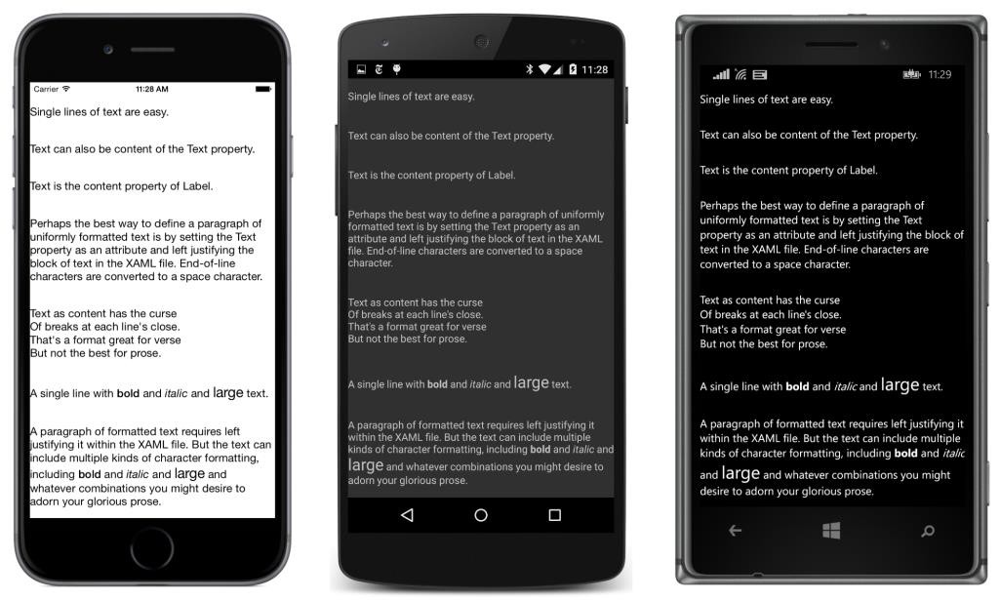

## Formatação do Texto {#formata-o-do-texto}

O texto apresentado por um arquivo XAML pode envolver apenas uma ou duas palavras, mas às vezes é necessário um parágrafo inteiro, talvez com alguma formatação de caracteres incorporado. Isso nem sempre é tão óbvio, ou tão fácil, em XAML como pode ser sugerido por nossa familiaridade com HTML.

A solução TextVariations tem um arquivo XAML que contém sete Label view para StackLayout:

&lt;ContentPage xmlns=&quot;[http://xamarin.com/schemas/2014/forms](http://xamarin.com/schemas/2014/forms)&quot; xmlns:x=&quot;[http://schemas.microsoft.com/winfx/2009/xaml](http://schemas.microsoft.com/winfx/2009/xaml)&quot; x:Class=&quot;TextVariations.TextVariationsPage&quot;&gt;

&lt;ContentPage.Padding&gt;

&lt;OnPlatform x:TypeArguments=&quot;Thickness&quot;

iOS=&quot;0, 20, 0, 0&quot; /&gt;

&lt;/ContentPage.Padding&gt;

&lt;ScrollView&gt;

&lt;StackLayout&gt;

…

&lt;/StackLayout&gt;

&lt;/ScrollView&gt;

&lt;/ContentPage&gt;

Cada um dos sete Label view mostra uma maneira um pouco diferente de definição do texto exibido. Para fins de referência, aqui está o programa em execução em todas as três plataformas:

A abordagem mais simples envolve apenas a criação algumas palavras para o atributo de texto do elemento Label:

&lt;Label VerticalOptions=&quot;CenterAndExpand&quot; Text=&quot;Single lines of text are easy.&quot; /&gt;

Você também pode definir a propriedade de texto, quebrando a como um elemento de propriedade:

&lt;Label VerticalOptions=&quot;CenterAndExpand&quot;&gt;

&lt;Label.Text&gt;

Text can also be content of the Text property.

&lt;/Label.Text&gt;

&lt;/Label&gt;

Text é a propriedade de conteúdo da Label, de modo que você não precisa das tags Label.Text:

&lt;Label VerticalOptions=&quot;CenterAndExpand&quot;&gt; Text is the content property of Label.

&lt;/Label&gt;

Quando você definir o texto como o conteúdo da Label(se você usar as tags Label.Text ou não), o texto é cortado: todos os espaços, incluindo tabulações, é removido do início e no final do texto. No entanto, todos os espaços incorporado é retido, incluindo caracteres de fim de linha.

Quando você definir a propriedade Text como um atributo de propriedade, todos os espaços dentro das aspas é mantido, mas os caracteres de fim de linha são convertidos em espaços.

Resultando em todo um parágrafo de texto formatado de maneira uniforme é um pouco problemático. Você pode colocar todo este parágrafo como uma única linha no arquivo XAML, mas se você preferir usar várias linhas, você deve justificar todo o parágrafo no arquivo XAML entre aspas, da seguinte forma:

&lt;Label VerticalOptions=&quot;CenterAndExpand&quot; Text=

&quot;Perhaps the best way to define a paragraph of uniformly formatted text is by setting the Text property as an attribute and left justifying the block of text in the XAML file. End-of-line

characters are converted to a space character.&quot; /&gt;

Os caracteres de fim de linha são convertidos em caracteres de espaço para que as linhas individuais sejam devidamente concatenadas. Mas cuidado: Não deixe quaisquer caracteres perdidos no final ou início das linhas individuais. Eles irão aparecer como caracteres estranhos dentro do parágrafo.

Quando várias linhas de texto são especificadas como conteúdo do Label, somente espaços em branco no início e no final do texto é aparado. Todos os espaços em branco incorporados são retido, incluindo caracteres de fim de linha:

&lt;Label VerticalOptions=&quot;CenterAndExpand&quot;&gt; Text as content has the curse

Of breaks at each line&#039;s close. That&#039;s a format great for verse But not the best for prose.

&lt;/Label&gt;

Este texto é processado como quatro linhas separadas. Se você está exibindo listas ou poesia em seu aplicativo Xamarin.Forms, isso é exatamente o que você quer. Caso contrário, provavelmente não.

Se a sua linha ou parágrafo do texto requer alguma formatação de parágrafos não uniforme, você vai querer usar a propriedade FormattedText de Label. Como você pode lembrar, em um atribuido FormattedString defina múltiplos objetos Span para a coleção Spans do FormattedString. Em XAML, você precisa de tags de property-element para Label.FormattedString, mas Spans é a propriedade de conteúdo de FormattedString:

&lt;Label VerticalOptions=&quot;CenterAndExpand&quot;&gt;

&lt;Label.FormattedText&gt;

&lt;FormattedString&gt;

&lt;Span Text=&quot;A single line with &quot; /&gt;

&lt;Span Text=&quot;bold&quot; FontAttributes=&quot;Bold&quot; /&gt;

&lt;Span Text=&quot; and &quot; /&gt;

&lt;Span Text=&quot;italic&quot; FontAttributes=&quot;Italic&quot; /&gt;

&lt;Span Text=&quot; and &quot; /&gt;

&lt;Span Text=&quot;large&quot; FontSize=&quot;Large&quot; /&gt;

&lt;Span Text=&quot; text.&quot; /&gt;

&lt;/FormattedString&gt;

&lt;/Label.FormattedText&gt;

&lt;/Label&gt;

Observe que as propriedades de Text não formatadas, tem espaços no início ou no fim da cadeia de texto, ou ambos, para que os itens não concatenem ao outro.

No caso geral, no entanto, você pode estar trabalhando com um parágrafo inteiro. Você pode definir o atributo de Text de Span para uma longa linha, ou você pode envolvê-lo em várias linhas. Tal como acontece com Label, mantenha o bloco inteiro justificado à esquerda no arquivo XAML:

&lt;Label VerticalOptions=&quot;CenterAndExpand&quot;&gt;

&lt;Label.FormattedText&gt;

&lt;FormattedString&gt;

&lt;Span Text=

&quot;A paragraph of formatted text requires left justifying it within the XAML file. But the text can include multiple kinds of character formatting, including &quot; /&gt;

&lt;Span Text=&quot;bold&quot; FontAttributes=&quot;Bold&quot; /&gt;

&lt;Span Text=&quot; and &quot; /&gt;

&lt;Span Text=&quot;italic&quot; FontAttributes=&quot;Italic&quot; /&gt;

&lt;Span Text=&quot; and &quot; /&gt;

&lt;Span Text=&quot;large&quot; FontSize=&quot;Large&quot; /&gt;

&lt;Span Text=

*   and whatever combinations you might desire to adorn your glorious prose.&quot; /&gt;

&lt;/FormattedString&gt;

&lt;/Label.FormattedText&gt;

&lt;/Label&gt;

Você vai notar no screen shot que o texto com o tamanho da fonte grande está alinhado com o texto normal na linha de base, que é a abordagem adequada tipograficamente, e o espaçamento entre linhas é ajustado para acomodar o texto maior.

Na maioria dos programas Xamarin.Forms, nem XAML nem código existem isoladamente, mas trabalham em conjunto. Elementos em XAML pode desencadear eventos tratados no código, e código podem modificar elementos em XAML. No próximo capítulo, você vai ver como isso funciona.